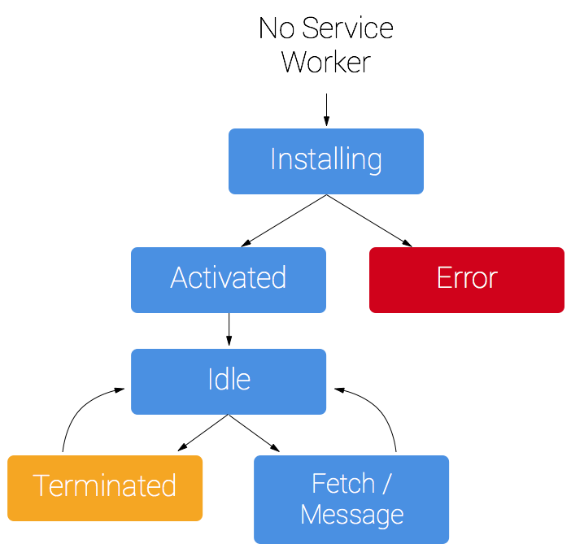

class: center, middle, titlescreen

# Starting with Progressive Web Apps (PWA)
## A talk by [@elzekool](https://github.com/elzekool)

---
# Introduction

### About me
* I'm a Magento developer at Youwe, from our office in Groningen
* Mainly a backend developer but trying to be cool and be full-stack

### About this talk
* For everyone that wants to what Progressive Web App stands for
* It is for developers that want to start creating Progressive Web Apps
* Has code samples to make everything clear

---
# Before we begin

### Slides

* I use a lot of text in my slides. I do this so that you can later read back the important things I mentioned

### Code examples
* I have made some examples, some I will discuss during the talk, you can find all of them in the `examples`folder.
* I use ES6 in my code samples. Most important to remember: `const` and `let` are the same as `var`. Only `const` 
doesn't allow assigning a new value. Also `(a,b) => a*b` and `(a,b) => { return a*b; }` is the same as `function(a,b) { return a*b; }` 

---
# Structure of the talk

#### **Definition of Progressive Web App**
<small>When is your site a Progressive Web App? What advantages are there and when will you use PWA? And how can you test compatibility?</small>

#### **Server workers, offline usability and push notifications**
<small>What are service workers and how do they relate to offline access and push notifications?</small>

#### **Building your first app with React**
<small>Build your first Progressive Web App with React. Rendering, routing and more.</small>

#### **Handling state with Redux**
<small>Organize changes in state with Redux and how to correctly implement async changes.</small>

#### **Common pitfalls**
<small>Device/browser specific issues, SEO, Server side rendering</small>

---
# Progressive Web App, intro

Independent designer `Frances Berriman` and Google engineer `Alex Russell` invented the term in `2015`. 
The term describes sites/app that take advantage of modern web techniques. So in short it is not a specific technique
but a set of characteristics that define the progessive web app. 

Frances Berriman & Alex Russell:

.width-25[] .width-25[]  

---
# Progressive Web App

Characteristics of a Progressive Web App are:
    
* Work on **every browser** and on **every device**. Use progessive enhancements.
* Work **offline** or on low quality networks
* **Feel like an app** to the user with app-style interactions and navigation.
* Uses **HTTPS** to prevent snooping and ensure content hasn’t been tampered with.
* Are **discoverable** by providing a W3C manifest.
* Make re-engagement easy through features like **push notifications** and **installation on their homescreen**.
* Can be **linked** to, and don't require installation.

---
# Progressive Web App checklist

From the characteristics a set of rules were created. The most important are: 

* Site is served over HTTPS
* Pages are responsive on tablets & mobile devices
* **All app URLs load while offline**
* **Metadata provided for Add to Home screen**
* **First load fast even on 3G**
* Site works cross-browser
* **Page transitions don't feel like they block on the network**
* **Each page has a URL**

I will focus on the **highlighted** items in this talk


---
# Lighthouse Audit

You can use Lighthouse inside Google Chrome to validate your site. There are multiple audit categories. One
of them is the Progressive Web App checklist:

.width-75[]

---
# Why should you care?

#### **Responsiveness**
Multiple items in the checklist are there to improve the user experience for your site. When
the user visits your site it is important that the user can interact with your site as soon as possible.

#### **Offline/limited usage**
In a realistic world you don't always have good internet. So your site users have the same.
Ever had the experience of no internet when you had to show your ticket?

#### **Engagement**
By allowing your site to be added to the home screen and/or app drawer your visitor is more likely to
visit your site again.


---
# Out of scope for this talk

#### **Serving pages trough HTTPS**
Ask your hosting provider for more assistance. If you host yourself, you can try
using Let's Encrypt, it has a tool to auto create/add certificates for free. Caddy is a server that includes Let's Encrypt
out of the box. A lot of techniques used in this talk work only on HTTPS (and localhost).

#### **Pages are responsive on tablets & mobile devices**
Use a correct `viewport` and implement media queries. A good starting point is using a CSS framework
like `Bootstrap`, `Foundation`, `UIKit` (and many others...)

#### **Site works cross-browser**
Test your site in different browsers. Use sites like `Browerstack` or `Saucelabs` to test in browsers
you don't have installed locally. You can use [http://browserl.ist/?defaults](http://browserl.ist/?defaults) to see a list of modern
browsers you should support.

---
# Promisses (1/2)

Promisses are an integral part of modern languages and are used in all new implemented features. Therefor it's important to
understand them.

Example promise creation:
```javascript
new Promise((resolve, reject) => {
    try {
        // Do some time consuming stuff
        resolve({ message : 'Hello world' });
    } catch (e) {
        reject(e);
    }
});
```
And usage:
```javascript
fetch('http://www.example.com/things')
    .then((result) => { console.log('Result'); })
    .catch((reason) => { console.log('Houston, we have a failure!'); });
```

---
# Promisses (2/2)

You can also chain promises. The functions `Promise.then()`, `Promise.catch()` return a new Promise. The resolution of
that Promise is based on the return value of the handler, an example:
```javascript
const promise = new Promise((resolve, reject) => {
    setTimeout(() => { resolve('I am resolved!'); }, 200);
});

promise
*   .then((result) => `I received: ${result}`)
    .then((result) => { console.log(result); })
    .catch((reason) => { console.log(reason.message); });
```

There is also `Promise.finally()` (analog to finally in try..catch), `Promise.resolve()` to create a resolved Promise and
`Promise.race()` / `Promise.all()` to wait for the first/all promises to resolve/reject.

---
# Web Worker (1/2)

Web Workers are scripts that are run in the background, detached from the UI or DOM. They are meant to allow scripts
to do long tasks without blocking, basically running multi-threaded.

Registration:
```javascript
const myWorker = new Worker('worker.js');
```

Due to the fact web workers run in a different thread you cannot access data directly you need the send/receive messages
with data. They also don't have access to the DOM.

Sending and receiving messages to/from the Web Worker (from UI):
```javascript
myWorker.postMessage([ 2, 5 ]);

myWorker.onmessage = (e) => {
  console.log('Message received from worker:', e.data);
}
```

---
# Web Worker (2/2)


Sending and receiving messages to/from the UI (from Web Worker):
```javascript
onmessage = (e) => {
  console.log('Message received from main script');
  const workerResult = `Result: ${(e.data[0] * e.data[1])}`;
  console.log('Posting message back to main script');
  postMessage(workerResult);
}
```

You can use `onmessage` in the Web Worker as this is defined in the global scope. Just like with the `window` object
in regular scripts. The global scope is also available as `self`.

.width-65[]


---
# Service Worker

A Service Worker is a special kind of **Web Worker** that in the background has two tasks:

* Network proxy (this is what allows offline usage). Better then AppCache as it is completely controlled by you.
* Entry point for push notifications

The Service Work spec is still in draft. If you have trouble sleeping, you can view the last draft on https://w3c.github.io/ServiceWorker/.
But the standard is mature enough to start working with it. With Safari now also joining the team it is supported in all
major platforms

.width-65[]


---
# CacheStorage API

The CacheStorage API is specifically meant for caching web assets. It's exposed in the `caches` object in the
global scope. `CacheStorage`allows creating multiple `Cache` instances. Each `Cache` can hold multiple items which are identified by their URL.
All functions return a `Promise`. 

Most important `CacheStorage` functions are:
* `CacheStorage.open(key)` creates/opens a `Cache` with given key. `CacheStorage.match(url)` looks in all `Cache` 
objects that match given URL. (Also available: `CacheStorage.keys()` and `CacheStorage.delete()`)

Most important `Cache` functions are:
* `Cache.add(url)/Cache.addAll([urls])` Takes an (array of) URLs, fetches and caches them. If you need the response you
need to fetch them yourself and use `Cache.put(url/request, response)` to save it to the cache. 
(Also available: `Cache.match(url)`, `Cache.delete(url/request)`, `Cache.keys()`)   
   

---
# Service Worker lifecycle

Registration of a service worker is just like creating a Web Worker:
```javascript
if ('serviceWorker' in navigator) {
  navigator.serviceWorker.register('/service-worker.js');
}
```

.width-45-r[]

On initial registration the first event is `installing`. This allows the Service Worker to do some initialization.

After initialization and next page load the service worker is `activated`. 

This means it receives `fetch` events on network requests in `scope`. 

---
# Service Worker initialization

This is very simple example of a Service Worker script. I uses the `On install` approach (for example to install the
`App Shell`) 

``` javascript
const preCacheList = [ 'index.html', 'script.js', 'bootstrap.min.css' ];
const cacheIdentifier = 'awesome-app-v1';

self.addEventListener('install', (event) => {
    console.log('Service Worker installing...');
    event.waitUntil(
        caches.open(cacheIdentifier).then(cache => cache.addAll(preCacheList))
    );
});

self.addEventListener('activate', (event) => {
    console.log('Service Worker activated!');
});

self.addEventListener('fetch', => (event) => {
    var url = new URL(event.request.url);
    if (
        url.origin === location.origin && 
        preCacheList.indexOf(url.pathname) !== -1
    ) {
        event.respondWith(caches.match(url.pathname));
    }
});
```

---
# Service Worker usage

You are completely free in your choice how and what you cache. Shown was `on install`. But other common options are
`cache with network fallback`, `network with cache fallback` and `cache with background fetch`. 

You can control the cache from both the UI and from the Service Worker so you can tailor your caching strategies to
your needs. Also a common used technique are fallback images when offline. 

Google created a NodeJS library that can easily be integrated with Gulp, Grunt and Webpack called `sw-precache`.
This tool can create a caching Service Worker for you. (https://github.com/GoogleChromeLabs/sw-precache)

---
# Push Notifications, intro

Push notifications are the notifications you get when something important happens. They can be annoying but when used
correctly they can greatly improve the engagement of the user with your site/app.

The `Push API` was created to consolidate all the different previous implementations. It is supported by all major browsers except Safari/iOS. This
means in the Netherlands the reach is about 60% and worldwide about 75%. The Apple API is outside the scope of this talk as it
not part of the PWA specs.

.width-100[]

---
# Push Notifications, workflow

Below a typical flow of functions/events is shown for the Push Notification functionality. Visible is that `Push` and `Notification` are
different API's:

.width-100[]

---
# Request permission, subscribe

A typical subscription flow would be: 

``` javascript

// Wait for service worker to be ready
navigator.serviceWorker.ready.then((registration) => {

    // Request permission to show notification
*   Notification.requestPermission()
        .then((result) => {
            if (result !== 'granted') {
                throw Error('No permission')
            }
            
            const options = {
                userVisibleOnly: true,
                applicationServerKey: VAPID_PUB_KEY
            };
            
            // Register with Push service
*           registration.pushManager.subscribe(options)
                .then((subscription) => {
                    // Send JSON.stringify(subscription) to backend application
                });
        });
    });
});
```

---
# VAPID

In the example on the previous page a value called `VAPID_PUB_KEY` could be seen. `VAPID` stands for 
"Voluntary Application Server Identification". 

In the call to the push service a header is added. This header contains a securely hashed JSON object with
the target audience (the endpoint of the notification service) and a subject (sender) identification. An example JSON 
document could be:

``` json
{
  "aud": "https://push.services.mozilla.com",
  "exp": 1458679343,
  "sub": "mailto:example@example.com"
}
```   
The hash is done using an asymmetric (different public and private) key pair. By providing the public key in the subscription
request only servers that can sign the message with the private key are allowed to push notifications.

In the `examples/push/vapid-keygen` folder is a script to create a key pair. 

---
# Send Push message

Push messages are send to the push service using the "Web Push Protocol". This is a standardized protocol. This means
a lot of packages are available, including:

* **NodeJS:** https://www.npmjs.com/package/web-push
* **PHP:** https://packagist.org/packages/minishlink/web-push
* **Python:** https://pypi.org/project/pywebpush/

NodeJS example:

``` javascript
const webpush = require('web-push');

webpush.setVapidDetails(
*   'mailto:example@example.com',
    publicKey,
    privateKey
);

const result = await webpush.sendNotification(
    JSON.parse(subscriptionJson), 
    'This is my great push message'
);
```

---
# Handle Push Message

When a message is sent to the push server a `push` event on the Service Worker is triggered. For this your site
does not need to be open. It's up to the browser to activate your Service Worker.

``` javascript
// Add an event listener that listens for push messages
*self.addEventListener('push', function(event) {
    if (!(self.Notification && self.Notification.permission === 'granted')) {
        return;
    }

    var title = 'Push example';
    var message = event.data.text();
    event.waitUntil(self.registration.showNotification(title, {
        body: message
    }));
});

// Add an event listener that handles notifications
*self.addEventListener('notificationclick', function(event) {
    event.notification.close();
    event.waitUntil(
        clients.openWindow('http://localhost:5040/examples/push/client-app/')
    );
});
```

---
# App Manifest

The `App Manifest` is an important part of a Progressive Web App. It is a descriptive JSON document about your application 
containing things like: 

* Name
* Icons
* Colors
* Display method (Fullscreen/Normal app like, Browser with/without navigation)

With a correct `App Manifest` your customer is able to add your app to the homescreen making it more likely that
they will revisit your site.

You link your `App Manifest` with a link tag:
``` html
<link rel="manifest" href="/manifest.webmanifest">
```

---
# App Manifest Example

Below you see an example of an App Manifest

``` javascript
{
  "name": "Demo App",
  "short_name": "Demo",
  "start_url": "index.html",
  "scope": "/",
  "theme_color": "#3367D6",
  "display": "standalone",
  "background_color": "#fff",
  "description": "A cool demonstration app",
  "icons": [
    {
      "src": "images/icon-192x192.png",
      "sizes": "192x192",
      "type": "image/png"
    },
    {
      "src": "images/icon-512x512.png",
      "sizes": "512x512",
      "type": "image/png"
    },
    // ...
  }]
}
```

---
# Add to home screen / app drawer

Unfortunately there is no standard for adding your app to the home screen. This is the current state:

* **iOS** There is a [+] Add to Home Screen option button in the Share menu.
* **Firefox** When served under HTTPS and with a valid App Manifest a House with a plus is added next to the address bar. 
See [https://hacks.mozilla.org/2017/10/progressive-web-apps-firefox-android/](https://hacks.mozilla.org/2017/10/progressive-web-apps-firefox-android/)

* **Chrome** Until Chrome 67 a popup was automatically shown if the app is served under HTTPS and has a valid App Manifest.
On newer versions you have to listen for the `beforeinstallprompt` event. Save the event value and call `event.promt()`
to show the prompt when applicable.
See [https://developers.google.com/web/fundamentals/app-install-banners/](https://developers.google.com/web/fundamentals/app-install-banners/)


---
# Create React App

React is not needed to create a Progressive Web App. You can use any library like Angular, Vue or even plain
javascript. I use React in this demo as I think it is the easiest way to start.

Using `create-react-app` (https://github.com/facebook/create-react-app) it is as easy as:

``` bash
yarn create react-app my-app
```

This will create:
* Empty React app.
* Full Webpack configuration including hot-reload development server.
* Script to build production ready application including App Manifest and Service Worker.


---
# React Component

React works with `Components`. Each component is responsible for maintaining state and rendering. To ease development
a special language called `JSX` is created. A component can be created in two ways. `Functional` and `Class` based.

An example of a functional React component:

``` javascript
import React from 'react';

const DemoComponent = ({ message }) => {
    return (
        <div>
            Hello {message}. This is an example component!
        </div>
    );
};

export default DemoComponent;
```

This component can be included into other components like:
`<DemoComponent message="world" />`


---
# React Component State

React components can keep state. To use this you need a Class Component. An example of this is:

``` javascript
import React, {Component} from 'react';

class DemoComponent extends Component {
    constructor(props) {
        super(props);
*       this.state = { count: 0 };
    }
    increaseCount() {
*       this.setState({
            count: this.state.count+1
        });
    }
    render() {
        return (
            <div>
                Hello {this.props.message}.
*               <button onClick={this.increaseCount}>
                    {this.state.count}x clicked!
                </button>
            </div>
        );
    }
};
```

---
# Redux Intro

Keeping state in every component is difficult. Libraries as React, Vue, Angular, KnockoutJS help with this as they 
allow us to focus on the state instead of the DOM representation. But when a lot of components are interconnected it
gets complicated fast. This is where `Redux` comes into play. It is based on `Event Sourcing` and `CQRS` and is build on three concepts:

#### **Single source of truth** 
There is only one tree with data (called store)

#### **State is read-only**
You cannot manipulate the state directly, you apply commands.
  
#### **Changes are made with pure functions**
A function (reducer) is used to calculate the new state from old state + command. Pure means no side-effect. So given the
same input it always gives the same output. 

---
# Redux, an example reducer

Below you find an example reducer. A Redux reducer accepts a state and action/command. It will look into the action
type to determine what todo. The `type` property is a requirement from Redux.

``` javascript
const initialState = { todos : [] };
const todoReducer = (state = initialState, action) {
    switch (action.type) {
        case 'ADD_TODO':
            return {
                ...state,
                todos: [
                    ...state.todos,
                    {
                      text: action.text,
                      completed: false
                    }
                ]
            };
            
        default
            return state;
    }
};

export default todoReducer;
```

---
# Redux usage

Below is a complete example. This also shows the utility `combineReducers`. This is used when you have multiple reducers.
Each action is dispatched to all registered reducers. 

``` javascript
import { combineReducers, createStore } from 'redux';
import todoReducer from './reducers';

const reducer = combineReducers({ todo: todoReducer })
const store = createStore(reducer)

store.dispatch({ type: 'ADD_TODO', text: 'Example' });

console.log(store.getState());
 
// {
//    todo: {
//      todos: [
//         { text: 'Example', completed: false }
//      ]
//    }
// }
```

---
# Redux Middleware
Redux middleware is executed on every dispatch. Two very common middleware libraries are: 

#### **Redux Logger** 
Redux logger adds state changes to the browser console making debugging a lot easier.<br />
.width-50[]

#### **Redux Thunk**
Redux reducers need to be pure. This is an issue with async calls. With `redux-thunk` you can dispatch a function.
This function is then executed with `dispatch` and `getState` as arguments. You can call the dispatch function async
and multiple times. 

---
# Use Redux with React
Using Redux with React is very simple using `redux-react`. Below is an example of adding Redux state and dispatch
functions to a Component:

``` javascript
import { connect } from 'react-redux';
import { setVisibilityFilter } from '../actions';
import TodoList from '../components/TodoList';
​
const mapStateToProps = (state, ownProps) => {
  return {
    todo : state.todo
  }
};
​
const mapDispatchToProps = (dispatch, ownProps) => {
  return {
    addTodo: (text) => {
      dispatch({ type: 'ADD_TODO', text : text })
    }
  }
};
​
const StatefulTodoList = connect(mapStateToProps,mapDispatchToProps)(TodoList);

​export default StatefulTodoList;
```

---
# Routing with React Router

For a Progressive Web App it is important that page navigation is direct. This means that page transitions should be
handled by the frontend script instead of browser navigation (this pattern is called `Single Page Application`). With
React this can be easily be achieved using `React Router`.
 
The Web based version support two types of routing: `HashRouter` (uses #path) and `BrowserRouter` (users /path). The first
is used when your server cannot rewrite non existing paths. Both use the `history` browser API.

React Router handles:
* Rendering different content based on route.
* Linking to different routes.
* Redirecting to a different route.
 
---
# Basic Example with React Router

Below is an example of an app with a Router. Using a router requires to encapsulate all components within a `BrowserRouter`
of `HashRouter` component. 

``` javascript
import React from 'react';
import { BrowserRouter } from 'react-router-dom';
import TodoList from './components/TodoList';
import TodoItem from './components/TodoItem';

const App = () => (
  <div>
    <Switch>
      <Route exact path='/' component={TodoList}/>
      <Route path='/todo/:id' render={
        ({match}) => (<TodoItem id={match.params.id} />)} 
      />
    </Switch>
  </div>
);


ReactDOM.render((
  <BrowserRouter>
    <App />
  </BrowserRouter>
), document.getElementById('root'));
```

---
# Redirecting with React Router

Redirecting with React Router is a little different then you might expect. A redirect is triggered by rendering 
a `Redirect` component.

An example:

``` javascript
const TodoItem = ({todo, id}) => {
    if (typeof todo[id] == void 0) {
        return (<Redirect to="/" />);
    }

    return (
        <div>
            <h1>Todo {id}</h1>
            <p>{todo.text}</p>
        </div>
    );
};

const mapStateToProps = (state, ownProps) => {
  return {
    todo : state.todo
  }
};

export default connect(mapStateToProps)(TodoItem);
```

---
# Design strategies

#### **Display something directly**
For a Progressive Web App it is imperative to show something on the screen directly. So make sure your App shell is rendered
before you try to load data from your backend.

#### **Graceful offline data**
Your Progressive Web App is offline capable but you might need extra backend data. When possible it is advised to cache
your retrieved data in a local storage (like LocalStorage, IndexedDB, etc.). 

A good way is by storing it with two time stamps 
(`StaleAfter`, `ExpiredAfter`). When current time is before `StaleAfter` you directly use the cached data. After that but before
`ExpiredAfter` you try to refresh but on failure use the data with a message. After `ExpiredAfter` the data is too old and an
error is shown that the user needs to go online.

---
# Common pitfalls

The world is not always a happy place. Things go wrong, these are some things that can bite you:

* Caching of Service Worker

* You can have multiple versions of your site running

* The browser that is used when your site/app is used from the home screen/app drawer is not the same as the normal browser

* Search engines cannot always render the frontend correctly using javascript

---
# Issue: Caching of Service Worker

Issue with the Service Worker is that it registered URL. It is not possible to use a cache buster (random query string).
So be careful with caching tags! Fortunately browsers will ignore any cache headers longer then 24 hours. 

An approach we use is by caching the service worker with Varnish. Varnish is a caching server that allows caching 
assets in different storages like memory. We cache our Service Worker for 24 hours in Varnish. We let Varnish send
no-cache headers to the browser. This will make the browser download the Service Worker every time. This request is very
fast with Varnish. On a deployment we forcefully update the cached version in Varnish. 

---
# Issue: Old client version

In the traditional pattern you serve a pre-cached version to the user from the service worker. In the background you
check if there is a new version. When there is a new version you pre-cache it and show a message to the user to refresh
the page.

**Issue**: Your site may call APIs that cannot handle the old client anymore. Or content in your site is aged

**Possible solution**: Give an expiration to your cached data, after this date your data is considered to old and
you force a refresh.

.width-40[]

---
# Issue: Schizophrenic browsers

When you let your customer install your site to the home screen.. the browser gets schizophrenic. Reason: The "normal"
browser is just that a normal browser. The browser instance that is used when opening as an app. In that case it is an
instance of the same component that is used in native apps when the want to use a browser. Due to security and backwards
compatibility there are differences.

Most annoying is iOS/Safari. There all storage is split between the regular browser and app browsers. In old versions of
iOS there was a delay in sync between the two storage's causing weird behaviour, in the last versions of iOS the storages are
completely isolated.

**Possible solution**: None really.. :( For iOS give a warning to users that the need to login again. Also don't switch domains (for login for example)
this may cause Safari to switch your app to the regular browser with that storage.

---
# Issue: Javascript rendering + SEO

Search engines like Google and Bing execute the scripts on your page on indexing but using client side rendering has it's issues:

#### **Unstable timing**
The timing of when the contents is grabbed on your page is different. There are even examples where part of the page was
indexed before any script executed and a different part was correctly grabbed after client side rendering.

#### **No headers**
When you render client side you cannot send any headers (like 401 Gone, 404 Not Found, etc., 301 Permanent Redirect) 
this will make it harder for the search engine to be up to date with the latest changes.

#### **Worse indexation**
Although the page itself is probably indexed fine, following links on your page is not as stable.

---
# Javascript rendering + SEO

The solution of indexation and SEO is to create an Isomorphic app. This is an App where the initial page load is rendered
on the server. Consequent navigation is done client side.

Important things to keep in mind when creating an Isomorphic App:

* **Keep your backend context less**: It's advisable to don't use global state like authentication status in your backend.
This not only will make your backend easier but also faster as it doesn't require any state locks. Apply authentication state
on the frontend (e.g. by using JWT)

* **Use as much shared code as possible** Rendering on the backend is sometimes a little different as on the frontend. But use as
much shared code as possible.

A well documented Isomorphic React Demo can be found under `/examples/isomorphic-demo/`.

---
# QR Code to Github repository
.width-75[]
